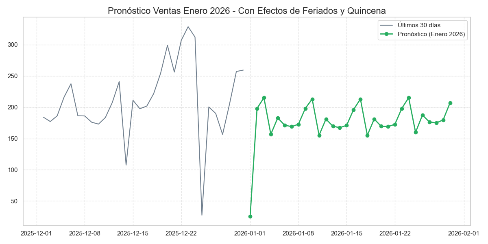
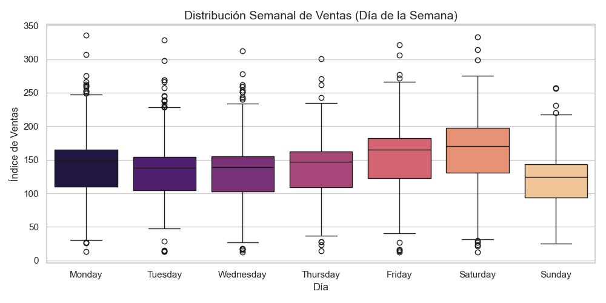
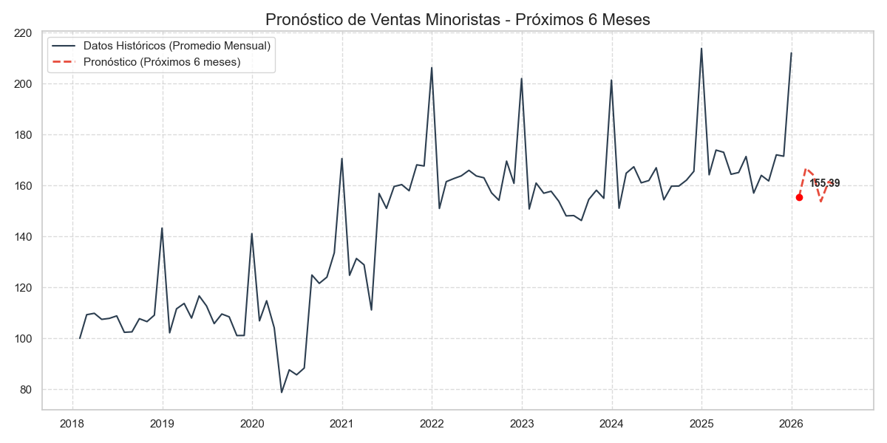
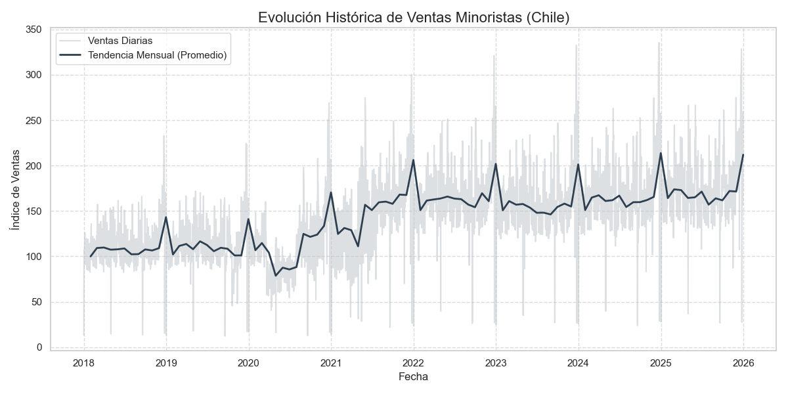
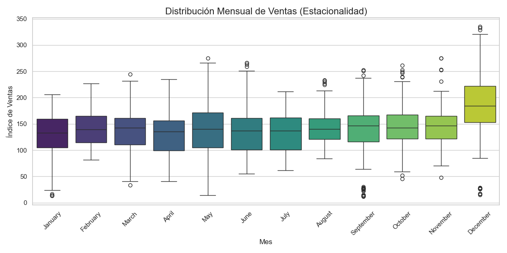

# Reporte de Pronóstico de Ventas Minoristas (Chile)

**Fecha de Generación:** 08-02-2026

## 1. Resumen Ejecutivo
El modelo de pronóstico indica que para el próximo mes (**January 2026**), se espera un índice promedio de ventas de **155.39**.
Esto representa una variación de **-5.37% vs año anterior**.

## 2. Análisis del Contexto Económico (Novedad)
**Diagnóstico: Crecimiento Robusto**

Al analizar el desempeño acumulado del año **2025** en comparación con **2024**, observamos una variación promedio del **+3.11%**.

**Interpretación:**
El sector muestra un desempeño superior al promedio histórico reciente. Esto sugiere una reactivación del consumo privado en retail, apoyado posiblemente por una estabilización inflacionaria y mejora en la liquidez de los hogares tras los periodos de ajuste económico (2022-2023).

*Nota: Este análisis se basa en el Índice de Ventas a Precios Constantes (descontando inflación), por lo que refleja el volumen real de ventas y no solo el aumento de precios.*

## 3. Análisis Detallado (Próximos 7 Días)
A continuación se presenta la proyección de venta diaria para la próxima semana, considerando el comportamiento semanal reciente.

| Fecha | Día | Predicción de Venta |
|-------|-----|-------------------|
| 01-01-2026 | Thursday | **25.91** |
| 02-01-2026 | Friday | **198.04** |
| 03-01-2026 | Saturday | **215.19** |
| 04-01-2026 | Sunday | **156.70** |
| 05-01-2026 | Monday | **182.91** |
| 06-01-2026 | Tuesday | **171.35** |
| 07-01-2026 | Wednesday | **168.99** |
| 08-01-2026 | Thursday | **172.72** |
| 09-01-2026 | Friday | **198.04** |
| 10-01-2026 | Saturday | **213.04** |
| 11-01-2026 | Sunday | **155.14** |
| 12-01-2026 | Monday | **181.08** |
| 13-01-2026 | Tuesday | **169.64** |
| 14-01-2026 | Wednesday | **167.30** |
| 15-01-2026 | Thursday | **170.99** |
| 16-01-2026 | Friday | **196.06** |
| 17-01-2026 | Saturday | **213.04** |
| 18-01-2026 | Sunday | **155.14** |
| 19-01-2026 | Monday | **181.08** |
| 20-01-2026 | Tuesday | **169.64** |
| 21-01-2026 | Wednesday | **168.99** |
| 22-01-2026 | Thursday | **172.72** |
| 23-01-2026 | Friday | **198.04** |
| 24-01-2026 | Saturday | **215.19** |
| 25-01-2026 | Sunday | **159.84** |
| 26-01-2026 | Monday | **187.48** |
| 27-01-2026 | Tuesday | **176.49** |
| 28-01-2026 | Wednesday | **174.90** |
| 29-01-2026 | Thursday | **179.62** |
| 30-01-2026 | Friday | **206.95** |

### Análisis de Variación Semanal
Se ha detectado un patrón semanal en las ventas:

## 4. Análisis de Tendencia (Largo Plazo)
La serie temporal promediada mensualmente muestra la siguiente evolución:

### Histórico vs Estacionalidad Anual

## 5. Proyección Mensual (Próximos 6 Meses)
| Fecha | Índice Predicho (Promedio Mensual) |
|-------|-----------------|
| 2026-01-31 | 155.39 |
| 2026-02-28 | 166.80 |
| 2026-03-31 | 164.06 |
| 2026-04-30 | 153.72 |
| 2026-05-31 | 161.45 |
| 2026-06-30 | 160.25 |

## 6. Ficha Técnica y Metodología

### Arquitectura del Modelo
El pronóstico se genera mediante un modelo de **Suavizamiento Exponencial Triple (Holt-Winters)** con las siguientes características:
- **Estacionalidad Multiplicativa**: Los picos de venta se calculan de forma proporcional al nivel del mes, evitando distorsiones por volumen.
- **Tendencia Amortiguada (Damped Trend)**: Se aplica un factor de amortiguación para evitar proyecciones de crecimiento irreal a largo plazo.
- **Granularidad Dual**: El sistema entrena un modelo mensual para captar la tendencia macro y un modelo diario para captar el patrón semanal (Lunes-Domingo).

### Heurísticas de Realismo Retail
Para asegurar que el modelo refleje la realidad del mercado chileno, se aplican las siguientes reglas de negocio post-modelo:
1. **Efecto "Fin de Mes" (Payday)**: Incremento progresivo entre los días 25 y 31 (pago de remuneraciones).
2. **Feriados Irrenunciables**: Corrección manual del 1 de Enero (caída del 85% por cierre legal).
3. **Precios Constantes**: Todos los cálculos se realizan sobre el índice real, eliminando el ruido provocado por la inflación.

---
*Este reporte fue generado automáticamente por el sistema de predicción Antigravity.*
